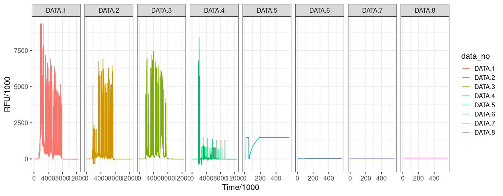

# Tests for the project "MCMC for Forensic Science" in Google Summer of Code 2020

## 1. Easy Test

### Problem Statement

Download data from [https://lftdi.camden.rutgers.edu/provedit/files/](https://lftdi.camden.rutgers.edu/provedit/files/) then use `seqinr::read.abif` to read and `seqinr::plotabif` to plot an fsa file.

First, I downloaded data from the given link. Then I installed the current version of `seqinr` package, which is used for biological sequences retrieval and analysis. In the following code, I used `seqinr::read.abif()` to read the fsa file(data) and then I plot the data extracted using `seqinr::plotabif()`.

### Code

```
library(seqinr)
#reading fsa file using read.abif()
data<-read.abif(file.choose ("A01-Ladder-PP16-001.20sec.fsa"))
#plotting the data
plotabif(data)
```
### Plot

Plot created is shown below:


## 2. Medium Test

### Problem Statement

To make a similar multi-panel ggplot with facet_grid.

### Code

```
library(seqinr)
library(ggplot2)
#reading fsa file
data_abif<-read.abif(file.choose ("A01-Ladder-PP16-001.20sec.fsa"))
data <- data_abif$Data

#creating dataframe df1 that stores DATA.1 values
time<-c(1:length(data[["DATA.1"]]))
data_number<-rep("DATA.1",length(data[["DATA.1"]]))
value<-data$DATA.1
df1<-data.frame(time,data_number,value)

#creating dataframe df2 that stores DATA.2 values
time<-c(1:length(data[["DATA.2"]]))
data_number<-rep("DATA.2",length(data[["DATA.2"]]))
value<-data$DATA.2
df2<-data.frame(time,data_number,value)

#creating dataframe df3 that stores DATA.3 values
time<-c(1:length(data[["DATA.3"]]))
data_number<-rep("DATA.3",length(data[["DATA.3"]]))
value<-data$DATA.3
df3<-data.frame(time,data_number,value)

#creating dataframe df4 that stores DATA.4 values
time<-c(1:length(data[["DATA.4"]]))
data_number<-rep("DATA.4",length(data[["DATA.4"]]))
value<-data$DATA.4
df4<-data.frame(time,data_number,value)

#creating dataframe df5 that stores DATA.5 values
time<-c(1:length(data[["DATA.5"]]))
data_number<-rep("DATA.5",length(data[["DATA.5"]]))
value<-data$DATA.5
df5<-data.frame(time,data_number,value)

#creating dataframe df6 that stores DATA.6 values
time<-c(1:length(data[["DATA.6"]]))
data_number<-rep("DATA.6",length(data[["DATA.6"]]))
value<-data$DATA.6
df6<-data.frame(time,data_number,value)

#creating dataframe df7 that stores DATA.7 values
time<-c(1:length(data[["DATA.7"]]))
data_number<-rep("DATA.7",length(data[["DATA.7"]]))
value<-data$DATA.7
df7<-data.frame(time,data_number,value)

#creating dataframe df8 that stores DATA.8 values
time<-c(1:length(data[["DATA.8"]]))
data_number<-rep("DATA.8",length(data[["DATA.8"]]))
value<-data$DATA.8
df8<-data.frame(time,data_number,value)

#combining all 8 dataframes into a data frame
df<-rbind(df1,df2,df3,df4,df5,df6,df7,df8)

#plotting multi-panel ggplot with facet_grid
ggplot(data = df,group=data_number,aes(color=data_number)) +
  geom_line(data = df,aes(x=time,y=value))+facet_grid(.~data_number,scales = "free_x")+
  scale_x_continuous(name = "Time/1000")+scale_y_continuous(name = "RFU/1000")
```
### Plot

Plot created by the above code is shown below:


